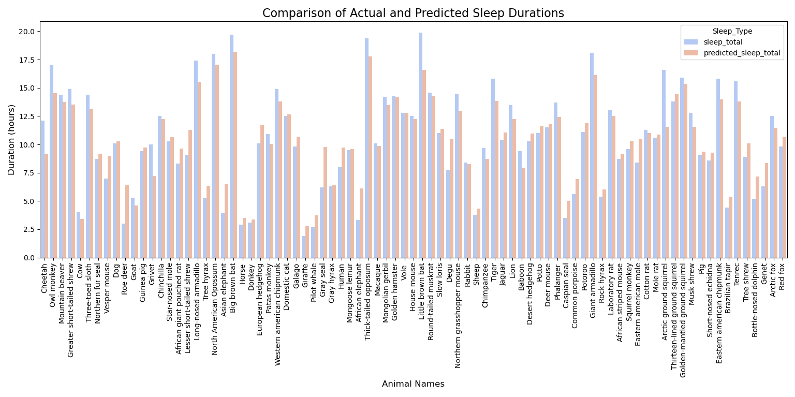

# Animal Sleep Analysis and Prediction

This project aims to **analyze and predict the sleep duration of animals** using machine learning models. Additionally, the results are visualized with barplots to provide clear insights. The project is divided into two main components:

1. **SleepPredictor**: Handles data preprocessing, training the machine learning model, and generating predictions.
2. **SleepPlotter**: Visualizes the sleep data with barplots, including comparisons between actual and predicted sleep durations.

---

## Table of Contents

- [Project Structure](#project-structure)
- [Installation](#installation)
- [Dataset](#dataset)
- [Classes and Methods](#classes-and-methods)
  - [SleepPredictor Class](#1-sleeppredictor-class)
  - [SleepPlotter Class](#2-sleepplotter-class)
- [Example Output](#example-output)
  - [Grouped Barplot](#grouped-barplot)
- [Performance Metrics](#performance-metrics)


---

## Project Structure

. ├── main.py # Main script to run the project <br>
. ├── sleep_predictor.py # Handles data processing and prediction tasks <br>
. ├── sleep_plotter.py # Handles data visualization tasks <br>
. ├── msleep.csv # Dataset used for the project <br>
. └── README.md # Documentation for the project <br>


---

## Installation

1. **Clone the repository**:
   ```bash
   git clone <your-repo-url>
   cd <your-repo-folder>
pip install pandas numpy matplotlib seaborn scikit-learn

---

## Dataset

The project uses the [`msleep.csv`](./msleep.csv) dataset, which contains information about various animals and their sleep patterns. The dataset includes the following features:

- **sleep_total**: Total sleep time (target variable)
- **sleep_rem**: REM sleep time
- **sleep_cycle**: Duration of one sleep cycle
- **bodywt**: Body weight (in kg)
- **brainwt**: Brain weight (in kg)
- **vore**: Dietary category (e.g., carnivore, herbivore)
- **conservation**: Conservation status of the animal
- **order**: Animal classification (e.g., primates, rodents)

---

## Classes and Methods

### 1. SleepPredictor Class

This class handles all the machine learning tasks, including:

- **Data Preprocessing**: Fills missing values, applies transformations, and scales features.
- **Model Training**: Uses a Random Forest Regressor to predict sleep durations.
- **Prediction Generation**: Generates predictions and calculates errors.

#### Key Methods:
- **`process_data()`**: Prepares the dataset by handling missing values and scaling features.
- **`train_model()`**: Trains the Random Forest model and prints performance metrics.
- **`get_results()`**: Returns a DataFrame with actual and predicted sleep totals, along with errors.

---

### 2. SleepPlotter Class

This class generates visualizations to compare the actual and predicted sleep durations.

#### Key Methods:
- **`plot_barplot()`**: Creates a barplot of actual sleep durations.
- **`plot_grouped_barplot()`**: Generates a grouped barplot to compare actual and predicted sleep durations.
---
## Example Output

### Grouped Barplot: Actual vs Predicted Sleep Durations  
(Replace this placeholder with your generated plot after running the code.)

---

### Grouped BarPlot


---

## Performance Metrics

After training the model, the following performance metrics are displayed in the console:

- **MSE (Mean Squared Error)**: Measures the average squared difference between predicted and actual values.
- **MAE (Mean Absolute Error)**: Measures the average absolute difference between predicted and actual values.
- **R² Score**: Indicates how well the predictions approximate the actual values (higher is better).
